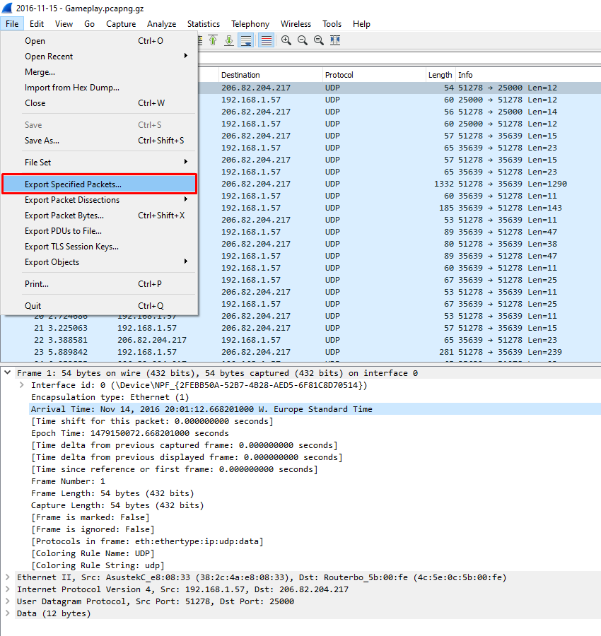
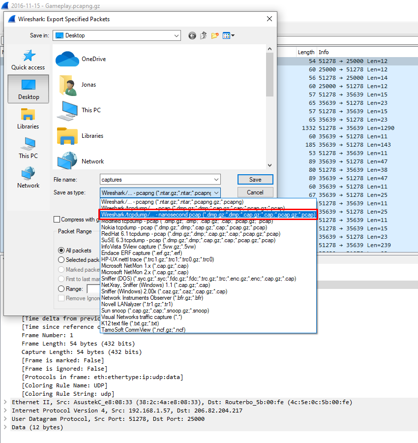
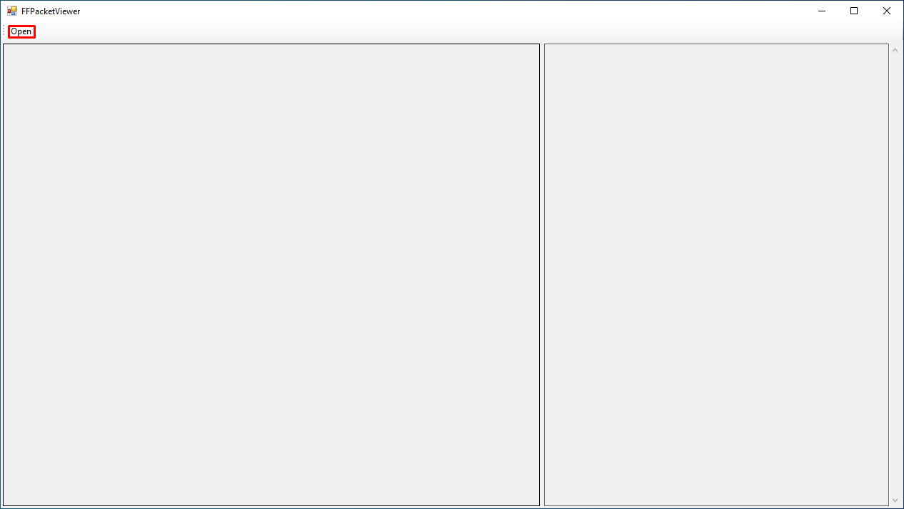
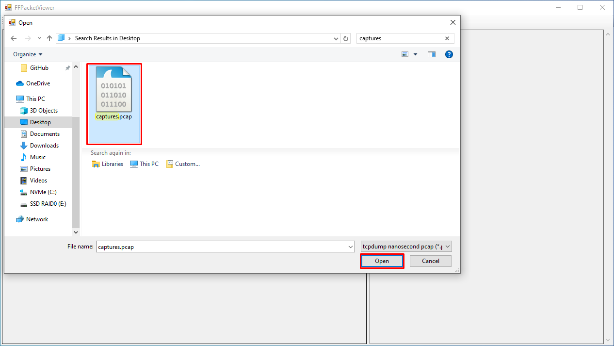

# FFPacketViewer
## Introduction
This tool can open tcpdump nanosecond pcap files and display them in an interactive viewer for research purposes about Firefall's Matrix protocol.
## Usage
If the packet captures you want to view are already saved in a tcpdump nanosecond pcap file (unlikely), proceed to step 3.
Otherwise you should start at step 1.
### Step 1
Open the file containing the packet captures in Wireshark. In this case it's a pcapng.gz file. Then nagivate to [File]->[Export Specified Packets...].

### Step 2
Export all packets in the tcpdump nanosecond pcap format.

### Step 3
Open the FFPacketViewer and click [Open] in the toolbar.

### Step 4
Select the tcpdump nanosecond pcap file in the dialog. Then click [Open].

